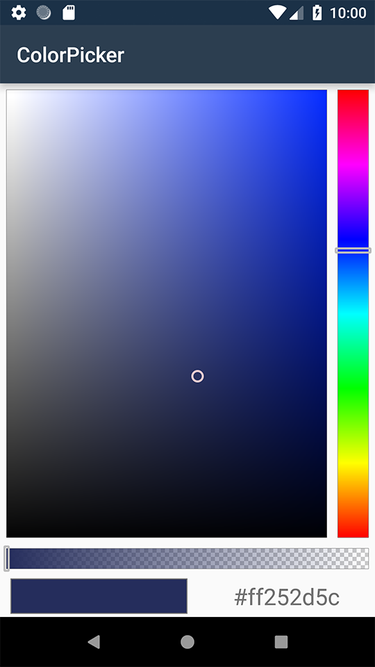

# Colorpicker

<a target="_blank" href="https://developer.android.com/about/versions/marshmallow/android-6.0"></a>
<a target="_blank" href="https://opensource.org/licenses/MIT"></a>
<a target="_blank" href="https://twitter.com/guruumeditation"></a>

Colorpicker control for Xamarin Android

This is the Xamarin version of Jared Rummler ColorPicker https://github.com/jaredrummler/ColorPicker

 


## Status

| Target | Branch | Status | SonarCloud | Package version|
--------------|------------- | --------- | --------|
| Release | master | <a target="_blank" href="https://equinoxe.visualstudio.com/ColorPicker/_build/latest?definitionId=27"></a> | <a target="_blank" href="https://sonarcloud.io/dashboard?id=75453910be17a48308232718dee64abe956d46c8"></a> | <a target="_blank" href="https://www.nuget.org/packages/Net.ArcanaStudio.ColorPicker/"></a>
| Preview | develop | <a target="_blank" href="https://equinoxe.visualstudio.com/ColorPicker/_build/latest?definitionId=25"></a>| <a target="_blank" href="https://sonarcloud.io/dashboard?id=75453910be17a48308232718dee64abe956d46c8"></a> | <a target="_blank" href="https://www.nuget.org/packages/Net.ArcanaStudio.ColorPicker/"></a>

## Screenshots

## Usage
### Preferences



You can use `ColorPreference` in preference :
```
<PreferenceScreen xmlns:android="http://schemas.android.com/apk/res/android"
                  xmlns:app="http://schemas.android.com/apk/res-auto">

  <PreferenceCategory android:title="Demo">
    <Net.ArcanaStudio.ColorPicker.ColorPreference
        android:defaultValue="0xFF3F51B5"
        android:key="default_color"
        android:summary="This is the default ColorPreference"
        android:title="Default color picker"/>

	...

  </PreferenceCategory>
</PreferenceScreen>
```
### Activity


You can use `ColorPickerView` in an activity like this :

##### layout

```
<?xml version="1.0" encoding="utf-8"?>
<LinearLayout
	xmlns:android="http://schemas.android.com/apk/res/android"
	xmlns:app="http://schemas.android.com/apk/res-auto"
	android:orientation="vertical"
	android:layout_width="match_parent"
	android:layout_height="match_parent">
	<Net.ArcanaStudio.ColorPicker.ColorPickerView
		android:defaultValue="0x890099CC"
		android:layout_width="fill_parent"
		android:layout_height="fill_parent"
		android:key="color_with_alpha"
		android:id="@+id/colorpicker"
		android:summary="A picker with alpha slider"
		android:title="Color picker with alpha"
		android:layout_weight="1"
		app:cpv_alphaChannelVisible="true" />
	<TableLayout
		android:minWidth="25px"
		android:minHeight="25px"
		android:layout_height="40dp"
		android:layout_width="match_parent"
		android:stretchColumns="*"
		android:id="@+id/tableLayout1">
		<TableRow
			android:id="@+id/tableRow1">
			<Net.ArcanaStudio.ColorPicker.ColorPanelView
				android:id="@+id/cpv_color_panel_new"
				android:layout_width="0dp"
				android:layout_height="fill_parent"
				app:cpv_colorShape="square"
				android:layout_marginBottom="3dp"
				android:layout_marginTop="3dp"
				android:layout_marginLeft="10dp"
				android:layout_marginRight="10dp" />
		<TextView
			android:text="Text"
			android:layout_width="0dp"
			android:layout_height="match_parent"
			android:gravity="center"
			android:id="@+id/textView1"
			android:textSize="22sp" />
		</TableRow>
	</TableLayout>
</LinearLayout>
```
##### Code

```
[Activity(Label = "@string/app_name", Theme = "@style/AppTheme", MainLauncher = true)]
    public class MainActivity : AppCompatActivity, IOnColorChangedListener
    {
        private Dictionary<string, string> _names;

        private TextView _textView;

        private ColorPanelView _colorPanelView;

        public void OnColorChanged(Color newColor)
        {
            _textView.Text = $"#{Integer.ToHexString(newColor.ToArgb())}";
            _colorPanelView.SetColor(newColor);
        }

        protected override void OnCreate(Bundle savedInstanceState)
        {
            base.OnCreate(savedInstanceState);

            // Set our view from the "main" layout resource
            SetContentView(Resource.Layout.layout1);

            var colorpickerview = FindViewById<ColorPickerView>(Resource.Id.colorpicker);
            _textView = FindViewById<TextView>(Resource.Id.textView1);
            _colorPanelView = FindViewById<ColorPanelView>(Resource.Id.cpv_color_panel_new);

            colorpickerview.SetOnColorChangedListener(this);
            colorpickerview.SetColor(Color.Lavender,true);

        }
    }
```

Implement `IOnColorChangedListener` to get the selectod color. Use `SetOnColorChangedListener` to set the listener


### Dialog

If you want a dialog, use :
```
 ColorPickerDialog.NewBuilder().SetColor(Color.Aqua).Show(activity);
```

`activity` being the current activity. That activity must implement `IColorPickerDialogListener` to get the selected color.

## Attributes

| name                | type      | documentation                                                                         |
|---------------------|-----------|---------------------------------------------------------------------------------------|
| cpv_dialogType      | enum      | "custom" to show the color picker, "preset" to show pre-defined colors                |
| cpv_showAlphaSlider | boolean   | Show a slider for changing the alpha of a color (adding transparency)                 |
| cpv_colorShape      | enum      | "square" or "circle" for the shape of the color preview                               |
| cpv_colorPresets    | reference | An int-array of pre-defined colors to show in the dialog                              |
| cpv_dialogTitle     | reference | The string resource id for the dialog title. By default the title is "Select a Color" |
| cpv_showColorShades | boolean   | true to show different shades of the selected color                                   |
| cpv_allowPresets    | boolean   | true to add a button to toggle to the custom color picker                             |
| cpv_allowCustom     | boolean   | true to add a button to toggle to the presets color picker                            |
| cpv_showDialog      | boolean   | true to let the ColorPreference handle showing the dialog                             |

## License

```
Copyright 2018 Arcana Studio

Permission is hereby granted, free of charge, to any person obtaining a copy of this software and associated documentation files (the "Software"), to deal in the Software without restriction, including without limitation the rights to use, copy, modify, merge, publish, distribute, sublicense, and/or sell copies of the Software, and to permit persons to whom the Software is furnished to do so, subject to the following conditions:
The above copyright notice and this permission notice shall be included in all copies or substantial portions of the Software.
THE SOFTWARE IS PROVIDED "AS IS", WITHOUT WARRANTY OF ANY KIND, EXPRESS OR IMPLIED, INCLUDING BUT NOT LIMITED TO THE WARRANTIES OF MERCHANTABILITY, FITNESS FOR A PARTICULAR PURPOSE AND NONINFRINGEMENT. IN NO EVENT SHALL THE AUTHORS OR COPYRIGHT HOLDERS BE LIABLE FOR ANY CLAIM, DAMAGES OR OTHER LIABILITY, WHETHER IN AN ACTION OF CONTRACT, TORT OR OTHERWISE, ARISING FROM, OUT OF OR IN CONNECTION WITH THE SOFTWARE OR THE USE OR OTHER DEALINGS IN THE SOFTWARE.
```

